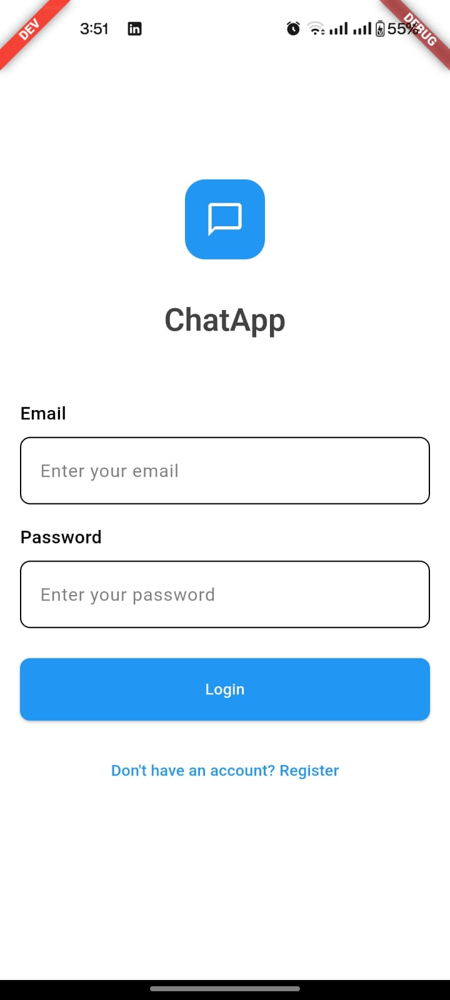
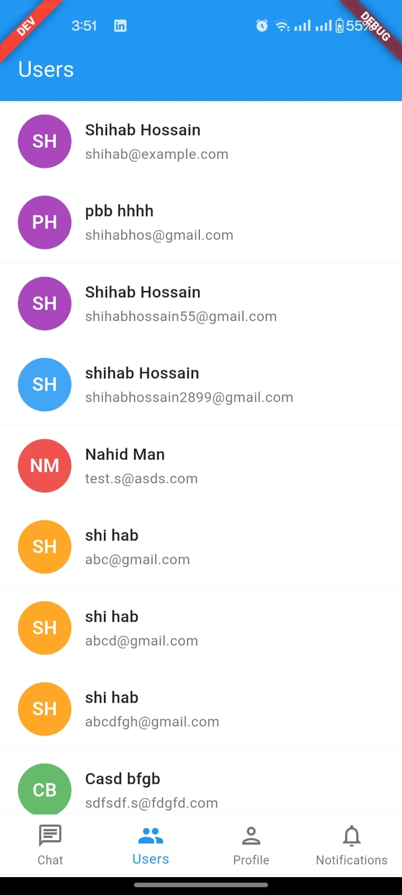
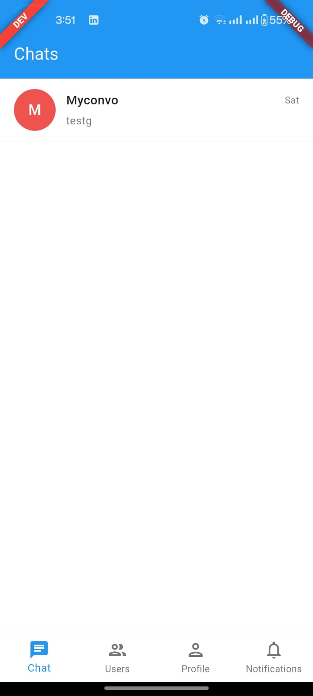
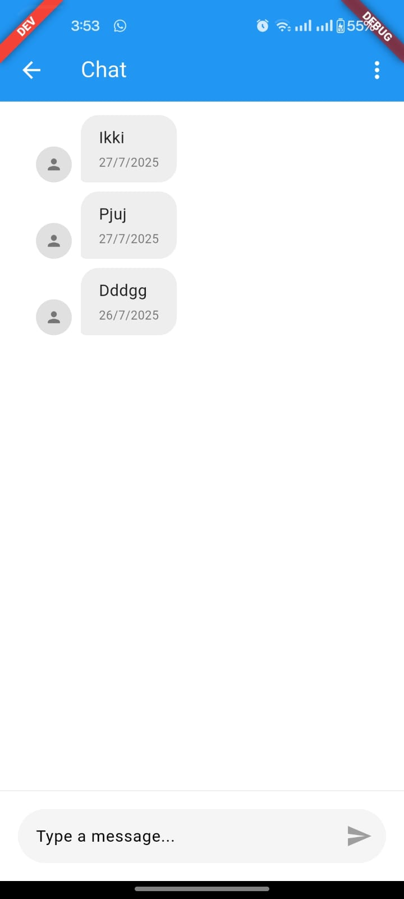

# Chat App User

A modern, cross-platform chat application frontend built with Flutter.

## Features

- Real-time 1:1 and group messaging
- User authentication (sign up, login, logout)
- Profile management
- Group creation and management
- Media sharing (images, files, documents)
- Push notifications
- Typing and online status indicators
- Message read receipts
- Video calling using Webrtc
- Responsive UI for mobile, web, and desktop
- Multiple environment support (development, staging, production)
- Error handling and loading states
- Clean architecture with BLoC pattern

## Screenshots

<div align="center">
  
  
  
  
</div>

## Getting Started

### Prerequisites

- [Flutter SDK](https://flutter.dev/docs/get-started/install)
- Dart
- Android Studio or Xcode (for mobile development)
- A backend server (not included in this repo)

### Backend Server

This project requires a backend server to function. You can find the official backend implementation here:

👉 [chat-app-server (GitHub)](https://github.com/Shihabagent47/chat-app-server)

Follow the instructions in the backend repository to set up and run the server locally or deploy it to your preferred environment.

### Installation

1. Clone the repository:
   ```sh
   git clone https://github.com/yourusername/chat_app_frontend.git
   cd chat_app_frontend
   ```
2. Install dependencies:
   ```sh
   flutter pub get
   ```
3. Run the app:
   ```sh
   flutter run
   ```

### Running with Flavors (Environments)

This project supports multiple environments (flavors): **development**, **staging**, and **production**. Each environment has its own main entrypoint.

To run the app in a specific environment, use the `--target` option with `flutter run`:

- **Development**
  ```sh
  flutter run --flavor development -t lib/main_development.dart
  ```
- **Staging**
  ```sh
  flutter run --flavor staging -t lib/main_staging.dart
  ```
- **Production**
  ```sh
  flutter run --flavor production -t lib/main_production.dart
  ```

You can use these commands for all supported platforms (Android, iOS, web, desktop). For example, to run the production flavor on web:

```sh
flutter run -d chrome --target=lib/main_production.dart
```

> **Note:** Make sure to use the correct device flag (`-d`) for your target platform.

## Project Structure

```
lib/
  config/
    environments/         # Environment configs (development, staging, production)
    app_config.dart       # App environment base class
  core/
    error/               # Error handling
    usecases/            # Base use case classes
  features/
    auth/                # Authentication feature (bloc, data, domain, presentation)
    chat/                # Chat feature (bloc, data, domain, presentation)
    ...                  # Other features
  shared/                # Shared widgets, services, utilities
  main.dart              # Main entrypoint
  main_development.dart  # Development flavor entrypoint
  main_staging.dart      # Staging flavor entrypoint
  main_production.dart   # Production flavor entrypoint
android/                 # Android platform code
ios/                     # iOS platform code
web/                     # Web platform code
macos/                   # macOS platform code
linux/                   # Linux platform code
windows/                 # Windows platform code
test/                    # Unit and widget tests
```

## Contributing

Pull requests are welcome. For major changes, please open an issue first to discuss what you would like to change.

## License

[MIT](LICENSE)
